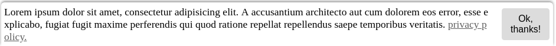

# easyCookie

## Installation

    
    
## Usage

Create session cookie:

    $.easyCookie('name', 'value'); // Set 1 day.
    
Or: 

    $.easyCookie('name', 'value', {
        expire: 5
    });
    
Options: 

     {
        domain: location.hostname,
        path: '/',
        secure: false,
        expire: 1
     }
    
## More Usage

Create session cookie:
    
    $.easyCookie().set('name', 'value'); // Set 1 day.
    
Create session cookie 2 months: 
    
    $.easyCookie().setMonth('name', 'value', 2); // Set 2 months.
    
Create session cookie 2 years: 
    
    $.easyCookie().setYears('name', 'value', 2); // Set 2 years.
    
Check session cookie: 
    
    $.easyCookie().has('name'); // true or false
    
Get session cookie: 
    
    $.easyCookie().get('name'); // string or null
    
Remove session cookie: 
    
    $.easyCookie().remove('name'); // true or false

Set multiple session cookie:

    const cookies = [
        {
            name: 'example_name_1',
            value: 'example_value_1',
            expire: 1,
            expire_type: 'days'
        },
        {
            name: 'example_name_2',
            value: 'example_value_2',
            expire: 1,
            expire_type: 'years'
        }
    ];
    
    $.easyCookie().setMulti(cookies); // Status array
    
Remove multiple session cookie:

    $.easyCookie().removeMulti(['example_name_1', 'example_name_2']); // Status array
    
Get all session cookie:

    $.easyCookie().getAll(); // object or array
    
Get session cookies count:

    $.easyCookie().count(); // int

# easyCookieConsent

   ## Installation
    
       
        
        
## Usage

    
    $.easyCookieConsent({
        content: {
            message: 'My message.',
            dismiss: 'My dismiss.',
            link: 'My link text.',
            href: 'My url.'
        }
    });
    
Set language:

    $.easyCookieConsent({
        country: true,
        language: {
            tr: {
                message: '...',
                dismiss: '...',
                link: '...',
                href: '...'
            },
            az: {
                message: '...',
                dismiss: '...',
                link: '...',
                href: '...'
            }
        }
    });
    
Default options:

    palette: {
        button: {
             text: '#000',
             background: '#ddd'
         },
         popup: {
             text: '#000',
             background: '#fff'
         },
         link: {
             text: '#606060',
             background: 'transparent'
         }
    },
    content: {
         message: 'Lorem ipsum dolor sit amet, consectetur adipisicing elit. A accusantium architecto aut cum dolorem eos error, esse explicabo, fugiat fugit maxime perferendis qui quod ratione repellat repellendus saepe temporibus veritatis.',
         dismiss: 'Ok, thanks!',
         link: 'privacy policy.',
         href: 'https://google.com'
    },
    country: false,
    language: {
        tr: {
           message: 'Lorem ipsum dolor sit amet, consectetur adipisicing elit. A accusantium architecto aut cum dolorem eos error, esse explicabo, fugiat fugit maxime perferendis qui quod ratione repellat repellendus saepe temporibus veritatis.',
           dismiss: 'Ok, thanks!',
           link: 'privacy policy.',
           href: 'https://google.com'
        }
    },
    cookie_name: 'easy_cookie_consent_status'
    
Preview:
    

